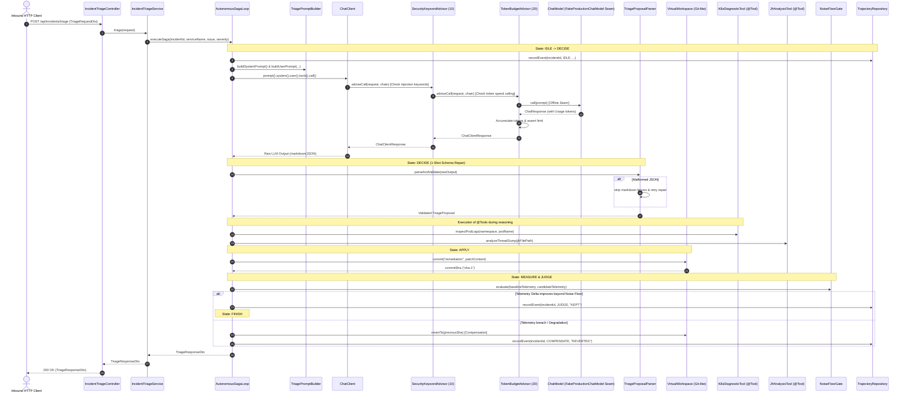

# Phase 08 Capstone: Production Autonomous Incident Triage Microservice
## Architecture, Requirements & Test Specification

**Target Repository Module:** `phase08-production-service`  
**Reference Architecture:** Autonomous diagnostic and remediation agents (e.g. [`agentic-performance-diagnostician`](https://github.com/syamsandi/agentic-performance-diagnostician))  
**Standard:** Enterprise Spring Boot 4.1.1 + Spring AI 2.0.1 (TigerStyle Engineering)

---

## 1. System Architecture Overview

Phase 08 breaks free from the artificial single-class drill structure (`*UnderTest.java`) and implements a **fully modular, multi-class Spring Boot microservice**. It synthesizes all foundational agentic primitives mastered in **Phases 01 through 07** into an enterprise-grade incident triage and self-healing pipeline.

### Component Interaction Flow



---

## 2. Knowledge Synthesis Matrix (Phases 01 – 07)

| Phase | Core Mechanic | Production Component | Concrete Responsibility |
|---|---|---|---|
| **Phase 01** | Prompt Engineering | `TriagePromptBuilder` | Dynamic templating with template variables (`serviceName`, `issue`, `severity`), system context isolation. |
| **Phase 02** | Structured Outputs & Repair | `TriageProposalParser` | Strips markdown fences, parses JSON record `TriageProposal`, executes 1-shot feedback repair retry on syntax error. |
| **Phase 03** | `@Tool` Calling & Reflection | `K8sDiagnosticTool`, `JfrAnalysisTool` | `@Tool` annotated methods, bounds checking, reflection discovery via `ToolCallbacks.from(bean)`. |
| **Phase 04** | Guardrails & Circuit Breakers | `SecurityKeywordAdvisor`, `TokenBudgetAdvisor` | `CallAdvisor` implementation: Order 10 blocks prompt injection keywords; Order 20 stops execution when total tokens exceed budget. |
| **Phase 05** | Deterministic Test Double Seam | `FakeProductionChatModel` | 100% offline, deterministic, zero-token `ChatModel` test double simulating dynamic tool calls, structured outputs, and repair prompts. |
| **Phase 06** | Telemetry Evaluators & Noise Floors | `NoiseFloorGate`, `GroundingEvaluator` | Validates telemetry improvements against P95 latency (15ms floor) and RPS (10.0 rps floor) plus error rate guard (<0.01). |
| **Phase 07** | Saga FSM & Git-like Compensation | `VirtualWorkspace`, `AutonomousSagaLoop` | 6-state FSM (`IDLE`, `DECIDE`, `APPLY`, `MEASURE`, `JUDGE`, `COMPENSATE`, `FINISH`), atomic workspace `commit` & `revertTo`. |
| **Phase 08** | Multi-Class Spring Boot Assembly | `AgentProperties`, `AgentAutoConfiguration`, Actuator, REST | `@ConfigurationProperties`, `@Bean` DI wiring, `AgentHealthIndicator` probe, `IncidentTriageController` REST API. |

---

## 3. Class-by-Class Architecture & Requirements

### 3.1 Domain Models (`phase08.model`)

#### 1. `IncidentSeverity` (Enum)
- **Values:** `LOW`, `MEDIUM`, `HIGH`, `CRITICAL`
- **Invariants:** Non-null.

#### 2. `DiagnosticTelemetry` (Record)
- **Fields:** `double p95LatencyMs`, `double throughputRps`, `double errorRate`
- **Invariants:**
  - `p95LatencyMs >= 0.0`
  - `throughputRps >= 0.0`
  - `errorRate >= 0.0 && errorRate <= 1.0`

#### 3. `TriageProposal` (Record)
- **Fields:** `String rootCause`, `String action`, `String targetResource`, `int confidencePercent`, `List<String> proposedPatches`
- **Invariants:**
  - `rootCause` and `action` must not be blank.
  - `confidencePercent` must be between `0` and `100`.
  - `proposedPatches` must not be null.

#### 4. `SagaState` (Enum)
- **Values:** `IDLE`, `DECIDE`, `APPLY`, `MEASURE`, `JUDGE`, `COMPENSATE`, `FINISH`

#### 5. `TrajectoryEvent` (Record)
- **Fields:** `String incidentId`, `SagaState state`, `String details`, `Instant timestamp`

#### 6. `TriageRequestDto` & `TriageResponseDto` (Records)
- **Request:** `String incidentId`, `String serviceName`, `String description`, `IncidentSeverity severity`
- **Response:** `String incidentId`, `String status`, `String rootCause`, `String headSha`, `int totalTokensUsed`

---

### 3.2 Configuration & Properties (`phase08.config`)

#### 1. `AgentProperties.java`
- **Annotation:** `@ConfigurationProperties(prefix = "agent.triage")`
- **Fields:**
  - `String defaultModel` (default: `"fake-production-model"`)
  - `int maxIterations` (default: `5`, must be `> 0`)
  - `int tokenCeiling` (default: `10000`, must be `> 0`)
  - `double p95NoiseFloorMs` (default: `15.0`)
  - `double rpsNoiseFloor` (default: `10.0`)
  - `List<String> securityBlacklist` (default: `["DROP TABLE", "DELETE FROM", "rm -rf", "eval("]`)
- **Unit Test:** [`AgentPropertiesTest.java`](../phase08-production-service/src/test/java/phase08/config/AgentPropertiesTest.java)
  - Assert defaults bind properly when empty.
  - Assert validation throws on invalid max iterations ($<= 0$).
  - Assert security blacklist contains required keywords.

#### 2. `AgentAutoConfiguration.java`
- **Annotation:** `@Configuration`, `@EnableConfigurationProperties(AgentProperties.class)`
- **Beans Produced:**
  - `@Bean @ConditionalOnMissingBean ChatModel chatModel()` -> fallback or production model.
  - `@Bean SecurityKeywordAdvisor securityKeywordAdvisor(AgentProperties props)`
  - `@Bean TokenBudgetAdvisor tokenBudgetAdvisor(AgentProperties props)`
  - `@Bean K8sDiagnosticTool k8sDiagnosticTool()`
  - `@Bean JfrAnalysisTool jfrAnalysisTool()`
  - `@Bean ChatClient chatClient(ChatModel model, SecurityKeywordAdvisor sec, TokenBudgetAdvisor tok, K8sDiagnosticTool k8s, JfrAnalysisTool jfr)`:
    - Sets default system prompt.
    - Adds advisors: `sec`, `tok`.
    - Registers tools via `defaultTools(ToolCallbacks.from(k8s, jfr))`.
  - `@Bean TrajectoryRepository trajectoryRepository()` -> `new InMemoryTrajectoryRepository()`
  - `@Bean NoiseFloorGate noiseFloorGate(AgentProperties props)`
  - `@Bean AutonomousSagaLoop autonomousSagaLoop(...)`

---

### 3.3 Prompt & Parser (`phase08.prompt`, `phase08.parser`)

#### 1. `TriagePromptBuilder.java`
- **Responsibilities:**
  - `buildSystemPrompt()`: Returns strict SRE triage persona instructing JSON output adhering to `TriageProposal` schema.
  - `buildUserPrompt(String serviceName, String issue, IncidentSeverity severity)`: Formats incident context:
    - `"Investigate incident for service [serviceName]. Severity: [severity]. Observed Issue: [issue]. Propose remediation in strict JSON."`
- **Invariants:** Rejects null or blank parameters with `IllegalArgumentException`.
- **Unit Test:** [`TriagePromptBuilderTest.java`](../phase08-production-service/src/test/java/phase08/prompt/TriagePromptBuilderTest.java)

#### 2. `TriageProposalParser.java`
- **Responsibilities:**
  - `cleanMarkdownFences(String raw)`: Strips ````json ... ```` or ```` ... ```` fences and leading/trailing whitespace.
  - `parse(String json)`: Uses Jackson `ObjectMapper` to deserialize into `TriageProposal`. Validates domain invariants (confidence $\in [0, 100]$, non-blank rootCause).
  - `parseWithRepair(String rawOutput, Function<String, String> repairPromptFunction)`:
    - Attempts `parse(cleanMarkdownFences(rawOutput))`.
    - On `JsonProcessingException` or invariant failure, executes `repairPromptFunction` **exactly once** passing the error message, and parses the repaired response.
    - If repair also fails, throws `IllegalStateException("Schema repair retry exhausted")`.
- **Unit Test:** [`TriageProposalParserTest.java`](../phase08-production-service/src/test/java/phase08/parser/TriageProposalParserTest.java)
  - Direct JSON parse.
  - Markdown fence stripped parse.
  - Successful 1-shot repair.
  - Exhausted retry throwing `IllegalStateException`.

---

### 3.4 Dynamic `@Tool` Diagnostic Beans (`phase08.tool`)

#### 1. `K8sDiagnosticTool.java`
- **Method:** `@Tool(description = "Inspect Kubernetes pod logs and container restart counts") String inspectPodLogs(@ToolParam(description = "Namespace") String namespace, @ToolParam(description = "Pod name") String podName)`
- **Invariants:** Rejects blank namespace/podName with error envelope `"Error: namespace and podName required"`.
- **Behavior:** Returns simulated pod status, e.g. `"Pod [podName] in [namespace]: 3 Restarts, OOMKilled detected in container main"`.

#### 2. `JfrAnalysisTool.java`
- **Method:** `@Tool(description = "Analyze Java Flight Recorder recordings for thread lock contention and allocation hot-spots") String analyzeThreadDump(@ToolParam(description = "Recording path") String jfrPath)`
- **Invariants:** Rejects paths outside sandbox (e.g. `../` traversal) with `"Error: Path traversal detected"`.
- **Behavior:** Returns analysis summary, e.g. `"JFR Analysis: 12 threads blocked on HikariCP connection pool lock"`.
- **Unit Test:** [`DiagnosticToolsTest.java`](../phase08-production-service/src/test/java/phase08/tool/DiagnosticToolsTest.java)
  - Valid tool calls return expected diagnostics.
  - Path traversal and blank parameters return safe error strings instead of uncaught exceptions.

---

### 3.5 Advisors & Guardrails (`phase08.advisor`)

#### 1. `SecurityKeywordAdvisor.java`
- **Implements:** `CallAdvisor`
- **Order:** `10` (Outer guardrail)
- **Requirements:**
  - Inspects user prompt for blacklisted keywords (`DROP TABLE`, `DELETE FROM`, `rm -rf`, `eval(`).
  - If keyword found, throws `SecurityException("Security breach: Blacklisted keyword detected")`.
  - Otherwise, delegates to `chain.nextCall(request)`.
- **Unit Test:** [`SecurityKeywordAdvisorTest.java`](../phase08-production-service/src/test/java/phase08/advisor/SecurityKeywordAdvisorTest.java)

#### 2. `TokenBudgetAdvisor.java`
- **Implements:** `CallAdvisor`
- **Order:** `20` (Inner guardrail)
- **Requirements:**
  - Maintains `AtomicInteger cumulativeTokens`.
  - In post-call, extracts `Usage` from `ChatClientResponse`. Defensively unboxes nullable `promptTokens` and `completionTokens`.
  - If `cumulativeTokens > tokenCeiling`, throws `IllegalStateException("Token budget ceiling breached: " + cumulativeTokens + " > " + ceiling)`.
- **Unit Test:** [`TokenBudgetAdvisorTest.java`](../phase08-production-service/src/test/java/phase08/advisor/TokenBudgetAdvisorTest.java)

---

### 3.6 Telemetry & Grounding Evaluators (`phase08.evaluator`)

#### 1. `NoiseFloorGate.java`
- **Requirements:**
  - Inputs: `DiagnosticTelemetry baseline`, `DiagnosticTelemetry candidate`.
  - Decision Logic:
    1. Error rate check: `candidate.errorRate() < 0.01` (hard guard).
    2. P95 latency improvement: `(baseline.p95LatencyMs() - candidate.p95LatencyMs()) > p95NoiseFloorMs`.
    3. Throughput improvement: `(candidate.throughputRps() - baseline.throughputRps()) > rpsNoiseFloor`.
    - Returns `true` if error rate is safe AND either P95 or RPS improved beyond noise floor.
- **Unit Test:** [`NoiseFloorGateTest.java`](../phase08-production-service/src/test/java/phase08/evaluator/NoiseFloorGateTest.java)

#### 2. `GroundingEvaluator.java`
- **Requirements:**
  - Inputs: `String proposalAction`, `List<String> evidenceSources`.
  - Verifies that proposed remediation is grounded in discovered diagnostic evidence.

---

### 3.7 Saga State Machine & Workspace (`phase08.saga`)

#### 1. `VirtualWorkspace.java`
- **Requirements:**
  - In-memory Git-like workspace managing revision commits.
  - `commit(String message, String content)`: Creates a new commit, returns commit SHA (`sha-1`, `sha-2`, etc.), updates HEAD.
  - `revertTo(String sha)`: Reverts workspace state back to specified commit SHA.
  - `getHeadSha()`: Returns current active SHA.
  - `getFileContent(String path)`: Returns current content.
- **Unit Test:** [`VirtualWorkspaceTest.java`](../phase08-production-service/src/test/java/phase08/saga/VirtualWorkspaceTest.java)

#### 2. `AutonomousSagaLoop.java`
- **Requirements:**
  - Coordinates the 6-phase Saga FSM:
    1. `IDLE -> DECIDE`: Invokes `ChatClient` with dynamic prompt and diagnostic tools.
    2. Parses `TriageProposal` with 1-shot repair.
    3. `DECIDE -> APPLY`: Commits patch to `VirtualWorkspace`.
    4. `APPLY -> MEASURE`: Evaluates simulated candidate telemetry.
    5. `MEASURE -> JUDGE`: Invokes `NoiseFloorGate`.
       - If KEEP: transitions to `FINISH`.
       - If REJECT: transitions to `COMPENSATE`, reverts `VirtualWorkspace`, and records compensation event.
    6. Records every state transition in `TrajectoryRepository`.
- **Unit Test:** [`AutonomousSagaLoopTest.java`](../phase08-production-service/src/test/java/phase08/saga/AutonomousSagaLoopTest.java)

---

### 3.8 Persistence & Audit (`phase08.repository`)

#### 1. `TrajectoryRepository.java` (Interface)
- `void save(TrajectoryEvent event)`
- `List<TrajectoryEvent> findByIncidentId(String incidentId)`

#### 2. `InMemoryTrajectoryRepository.java`
- Thread-safe repository using `ConcurrentHashMap<String, CopyOnWriteArrayList<TrajectoryEvent>>`.
- **Unit Test:** [`InMemoryTrajectoryRepositoryTest.java`](../phase08-production-service/src/test/java/phase08/repository/InMemoryTrajectoryRepositoryTest.java)

---

### 3.9 Actuator Health (`phase08.health`)

#### 1. `AgentHealthIndicator.java`
- **Implements:** `org.springframework.boot.health.contributor.HealthIndicator`
- **Requirements:**
  - Probes `ChatModel` availability with a minimal ping prompt (`"ping"`).
  - If model responds, returns `Health.up().withDetail("model", properties.getDefaultModel()).build()`.
  - If model throws, returns `Health.down(ex).withDetail("reason", "Model unreachable").build()`.
- **Unit Test:** [`AgentHealthIndicatorTest.java`](../phase08-production-service/src/test/java/phase08/health/AgentHealthIndicatorTest.java)

---

### 3.10 Service & Web Controller (`phase08.service`, `phase08.web`)

#### 1. `IncidentTriageService.java`
- Injects `AutonomousSagaLoop`, `AgentProperties`, `TrajectoryRepository`.
- Exposes `TriageResponseDto triageIncident(TriageRequestDto request)`.

#### 2. `IncidentTriageController.java`
- **Annotation:** `@RestController`, `@RequestMapping("/api/incidents")`
- **Endpoints:**
  - `POST /api/incidents/triage`: Accepts `@RequestBody TriageRequestDto`, validates non-null fields, invokes service, returns `ResponseEntity<TriageResponseDto>`.
  - `GET /api/incidents/{id}/trajectory`: Returns `List<TrajectoryEvent>` audit history.
- **Unit Test:** [`IncidentTriageControllerTest.java`](../phase08-production-service/src/test/java/phase08/web/IncidentTriageControllerTest.java)

---

## 4. End-to-End Integration Test Specification

**Target File:** [`IncidentTriageEndToEndIntegrationTest.java`](../phase08-production-service/src/test/java/phase08/integration/IncidentTriageEndToEndIntegrationTest.java)

### Test Configuration:
- Annotated with `@SpringBootTest(classes = {Application.class, TestConfig.class})`.
- Injects `@Primary` `FakeProductionChatModel` to ensure 100% offline, zero-token cost, deterministic execution.

### Verification Flow:
1. Injects `IncidentTriageController`, `TrajectoryRepository`, `AgentProperties`.
2. Dispatches `TriageRequestDto("INC-E2E-999", "payment-service", "Deadlock and high Hikari pool acquisition wait times", IncidentSeverity.CRITICAL)`.
3. Asserts:
   - HTTP Status: `200 OK`.
   - Response DTO: `incidentId == "INC-E2E-999"`, `status == "RESOLVED"`, `headSha == "sha-1"`.
   - Trajectory Repository: Contains audit events across states `IDLE`, `DECIDE`, `APPLY`, `MEASURE`, `JUDGE`, `FINISH`.
   - Advisors: Security guardrail and Token budget verified during dispatch.

---

## 5. Test Suite Verification Matrix

All 32 tests run offline in ~13 seconds:

```bash
# Run entire Phase 08 test suite:
mvn test -pl phase08-production-service

# Run individual class test suites:
mvn test -pl phase08-production-service -Dtest=AgentPropertiesTest
mvn test -pl phase08-production-service -Dtest=TriagePromptBuilderTest
mvn test -pl phase08-production-service -Dtest=TriageProposalParserTest
mvn test -pl phase08-production-service -Dtest=DiagnosticToolsTest
mvn test -pl phase08-production-service -Dtest=SecurityKeywordAdvisorTest
mvn test -pl phase08-production-service -Dtest=TokenBudgetAdvisorTest
mvn test -pl phase08-production-service -Dtest=NoiseFloorGateTest
mvn test -pl phase08-production-service -Dtest=VirtualWorkspaceTest
mvn test -pl phase08-production-service -Dtest=AutonomousSagaLoopTest
mvn test -pl phase08-production-service -Dtest=InMemoryTrajectoryRepositoryTest
mvn test -pl phase08-production-service -Dtest=AgentHealthIndicatorTest
mvn test -pl phase08-production-service -Dtest=IncidentTriageControllerTest
mvn test -pl phase08-production-service -Dtest=IncidentTriageEndToEndIntegrationTest
```
